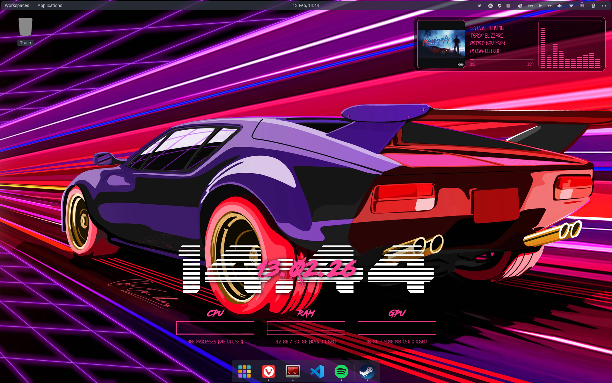

# eww-configuration

## Pre-requisites

- Install [eww](https://elkowar.github.io/eww/) by following the build instructions
- Install `playerctl`, instructions [from here](https://github.com/altdesktop/playerctl).
- Install `cava` (relied upon by the audio visualiser), instructions [from here](https://github.com/karlstav/cava).

## Installation

- clone this repo
- install the fonts within the `fonts/` directory, or modify the CSS to use your own desired fonts
- copy to `.config/eww/` directory
- Make scripts executable `chmod a+x *.sh`
- Run `./eww.sh` to Launch

## Configuration

- You can change the colours and design of the widgets via the CSS etc.
- Fonts used are included in the repo
- The `wallpaper.jpeg` is the background I use

## Example

I use COSMIC DE on Pop_OS! 24.04 currently.

## Known Issues

- Occasionally there is some _stuttering_ with the bars, and it seems to be around the reading of the raw cava output (my guess anyway)
